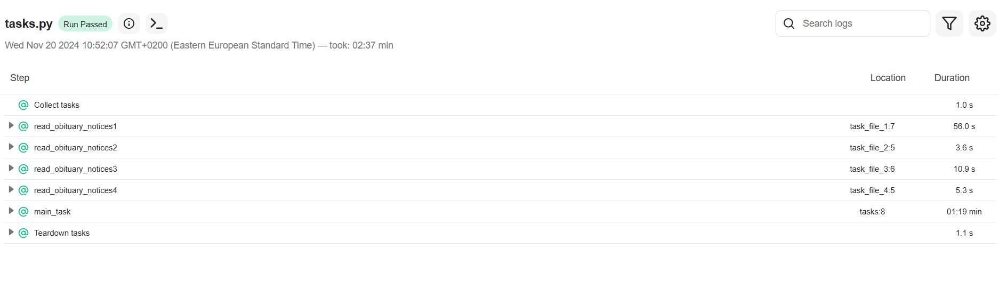
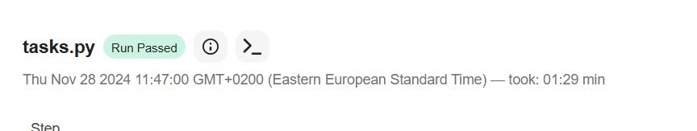
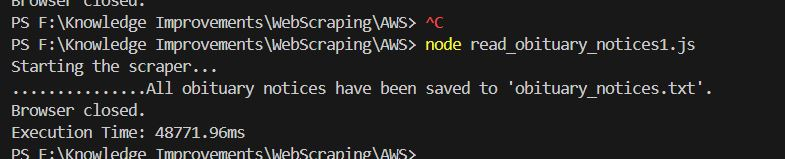
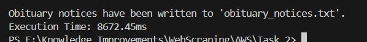
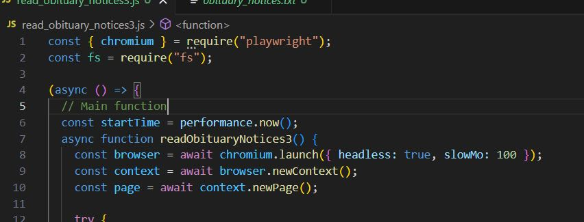
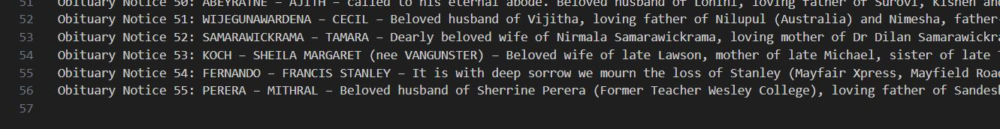
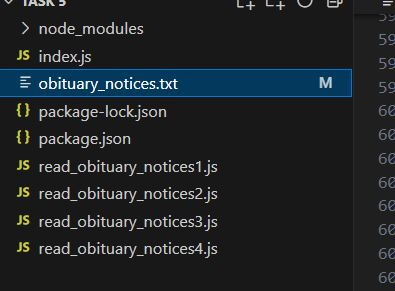
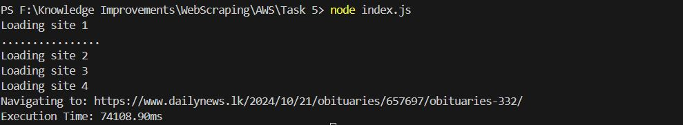
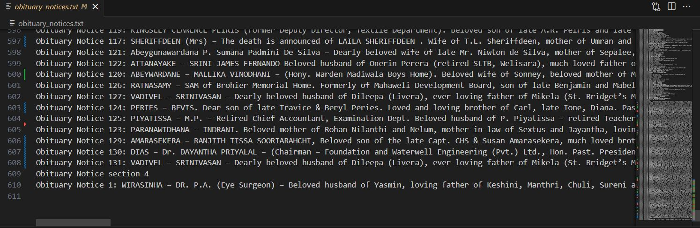

# Project Memoriam

Objective - Web scraping - retrieve data from different targeted websites to a centralized location
(obituary notices - historical data) --- write a script to retrieve data
give minimal effort

what would be the streamline process for this? technologies /tool will utilize?
whether data retrieve from this is accurate
what different data structure have? volume of it
any data processing tools?
what deliverables

Retrieve data
Store data
ETL

1- Australian - https://www.elanka.com.au/obituaries/

2 - Canada (Times of Lanka) - https://reserved767.rssing.com/chan-65241722/all_p1.html

3 - LK (Sunday Times) - https://www.sundayobserver.lk/category/obituaries/

4 - LK (Daily News Archive) - https://www.dailynews.lk/2024/10/21/obituaries/657697/obituaries-332/

Title the project "memoriam"

############################################################################################

## My Selection is sema4ai with Robocorp Framework using python.

To create the "Memoriam" project with Robocorp’s Sema4AI using Python for web scraping obituary data, we’ll focus on automating the following core tasks: retrieving data, structuring and storing it, and performing ETL (Extract, Transform, Load) processes. Below is a detailed plan with tools, methods, and considerations for each stage.

### Step 1: Define a Streamlined Process

1. Identify Target Websites and Elements
   First, analyze the page structure for each website to identify the HTML elements containing obituary data such as names, dates, ages, and other relevant fields.
   Since each website structure varies, you’ll need separate scrapers for each website, making XPath or CSS selector location crucial.

2. Set Up the Robocorp Environment
   Robocorp provides the tools to create Python-based robots that can automate browser interactions. Using Robocorp’s Sema4AI platform, you can write scripts to navigate each target website, locate obituary notices, and extract relevant data.

3. Data Retrieval and Extraction
   Web Scraping Libraries: Use Python libraries like requests for fetching HTML data and BeautifulSoup or lxml for parsing it.
   Accuracy of Data Retrieval: Since obituaries may have inconsistent formatting, set up error-handling routines to manage missing data points, ensuring each record is captured accurately.

4. Data Storage and Structuring
   After data extraction, the information should be structured for ease of access and analysis. A JSON or CSV format would work well as an intermediary storage format.
   For longer-term storage, consider using a database like PostgreSQL or a cloud-based solution like Google BigQuery, especially if the dataset grows over time.

5. ETL Pipeline
   Extract: The script collects and parses obituary data.
   Transform: Normalize the data into a consistent structure (e.g., standardize date formats, extract names, and locations).
   Load: Insert the transformed data into a central database, which could be structured as per the required reporting or data analysis formats.
   Technologies and Tools to Utilize
   Robocorp’s RPA Framework: Automates the workflow, especially for navigating and scraping data from complex websites.

### Python Libraries:

requests and BeautifulSoup for web scraping.
pandas for data cleaning, transformation, and CSV/JSON handling.
SQLAlchemy for database interactions if using SQL databases.
Data Storage Options:
For lightweight storage, use SQLite or store the data as JSON/CSV.
For larger datasets, a relational database such as PostgreSQL or cloud storage like Google Cloud Storage is recommended.

## Workflow Overview

### Script for Each Website:

Write a dedicated Python function for each site to navigate its structure, fetch relevant obituary records, and return structured data.

### Centralized Data Collection:

Store the data from each website in a consistent format (JSON or CSV) in a temporary directory for further processing.

### ETL Pipeline:

Create a central ETL script to clean, format, and insert the extracted data into a structured database.
Schedule and Monitor:

Set up the Robocorp robot to run on a schedule, automatically checking for new obituaries at regular intervals.
Advantages and Disadvantages
Advantages
Automation Efficiency: Robocorp allows automated execution, requiring minimal manual intervention once set up.

### Scalability: Can handle multiple websites, adding more as needed.

Centralized Storage: Streamlines data into a centralized location for ease of analysis and access.
Disadvantages
Variability in Website Structure: Web scraping scripts may break if websites update their layouts, requiring maintenance.
Legal Compliance and Ethics: Ensure adherence to each site’s Terms of Service for scraping.
Data Quality and Consistency: Varying data structures across websites can lead to inconsistencies in extracted data.
Data Structure and Processing

### Data Structure:

Fields: name, date, age, location, publication, URL.
Volume: Initially, expect a small dataset (hundreds of records), but with historical data, this could grow significantly over time.

### Data Processing:

Use pandas for data cleaning and transformations, such as date standardization.
Apply natural language processing (NLP) for advanced tasks like extracting additional structured data (e.g., relationships).

## Deliverables

###### Python Scripts: Separate scripts for each site’s data extraction.

###### Central Database: A database or file storage system to hold the data in a consistent format.

###### ETL Pipeline: Script to clean and load data into the central repository.

###### Documentation: Detailed guide for maintaining and extending the robot to other sites.

###### Reports/Dashboards: Basic analytical outputs or visualizations summarizing obituary trends, possibly using tools like Tableau or Power BI if needed.

By leveraging Robocorp’s Sema4AI with Python, you can automate obituary data collection, manage a centralized data repository, and establish a scalable ETL pipeline that efficiently retrieves and processes obituary records across multiple sites.

# Why select this option ?

1. **Simple Python Scripting**: This framework uses simple Python scripting, allowing flexibility to perform various tasks. It also facilitates big data analysis with many available open-source libraries.

2. **Data Storage and Transfer Options**: There are numerous libraries available for data storage, import, and export, providing flexibility in managing data.

3. **Robocorp Integration**: Robocorp provides a control panel, enabling the use of this framework as a cloud application with data storage in the cloud. Additionally, cloud vaults can be used to securely store credentials (not yet implemented).

4. **Dynamic Data and Variables**: Variables and dynamic data can be stored in a separate file, so they don’t need to be modified within the code itself.

5. **Efficient Performance**: This framework runs Python scripts, offering faster performance compared to other frameworks.

### The pricing information for the Robocorp Framework is available in below link

https://sema4.ai/docs/automation/pricing

### The code for the given web pages as follows, (13-11-2024)

Task 1- Australian - https://www.elanka.com.au/obituaries/

Task 2 - Canada (Times of Lanka) - https://reserved767.rssing.com/chan-65241722/all_p1.html

Task 3 - LK (Sunday Times) - https://www.sundayobserver.lk/category/obituaries/

Task 4 - LK (Daily News Archive) - https://www.dailynews.lk/2024/10/21/obituaries/657697/obituaries-332/

## The sample code for the "Task 1" is as follows,

### The sample results for the "Task 1" is as follows,

The result will be inside the Task folder once you run the program under "obituary_notices.txt" file

So it has around 627 Notices in the first web page and only takes 01:54 min to complete the task.

### The log data can be found in below location

./Memoriam/Task 1/ output/log.html

## The sample code for the other Tasks,

#### The content is similar, but there are some minor differences in data scraping methods. The detailed source code can be found in the relevant folders, and sample results are shown below.

"This can be updated further based on the requirements."

### Further Improvements (20-11-2024) - Task 8 -

The code is updated to fetch all 4 websites in single script and upload all the data to a single file. The browser mode is updated to headless mode for higher efficiency.

#### The total timing was 2.37s as per log.

And total of 556 notices were scraped.

The latest code included the obtain more data with Load More function in the site 3.

The obtained data can be found in obituary_notices.txt in the Task 8 folder

### Further Improvements (25-11-2024) - Task 9 / Task 10 -

The data processing and Data extraction methods included in Task 9 and Task 10

### Further Improvements (28-11-2024) - using - NodeJS -

The same objective is obtained using NodeJS and the execution time was analyzed,

<ins>Execution time with Sema4 (Python)</ins>

<ins>Execution time with Playwright (NodeJS)</ins>

The NodeJS with playwright took **48 s** and using python with sema4 took **1.29 min**

So it would be beneficial to use NodeJS with Playwright considering the performance.

### Further Improvements (02-12-2024) - using - NodeJS -

When using the second website (2 - Canada (Times of Lanka) - https://reserved767.rssing.com/chan-65241722/all_p1.html) to scrape 127 records it took **8.7 s**.

### Further Improvements (03-12-2024) - using - NodeJS -

When using the second website (3 - LK (Sunday Times) - https://www.sundayobserver.lk/category/obituaries/) to scrape 55 records it took **14.26 s**.

### Further Improvements (12-12-2024) - using - NodeJS -

It took **74.1 s** to consolidate aroud 600 lines from all 4 websites. Compared to other frameworks NodeJS has more advantages.

## - Further Improvements on AWS Implementation
